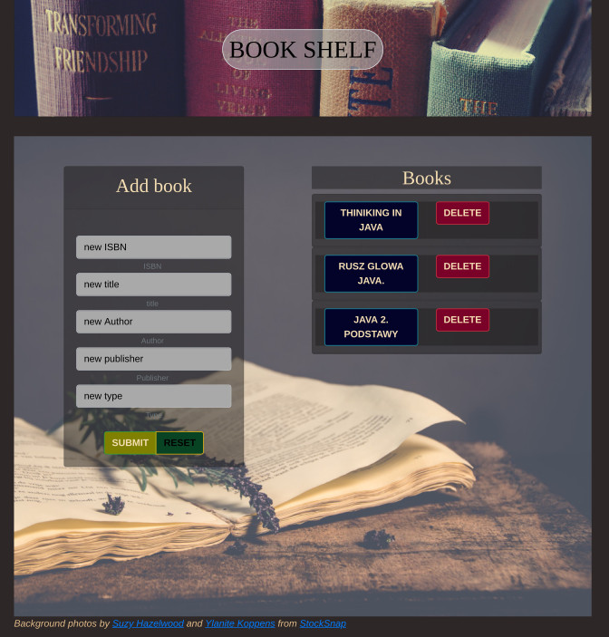
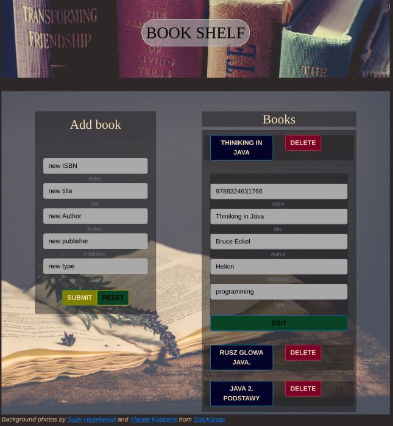

# BOOK SHELF
Aplikacja Book Shelf symuluje półkę z książkami, w której użytkownik może dodawać, usuwać i edytować książki.
Przykładowe widoki aplikacji przedstawiono na rysunkach 1 i 2.

##Widok i najważniejsze funkcje

W aplikacji Klient implementuje tylko stronę główną. 

W górnym lewym rogu strony widoczny jest formularz ADD BOOK. Służy on do tworzenia nowych książek poprzez
wysyłanie danych AJAX-em (metoda POST, endpoint /books/).
W prawym górnym rogu przedstawione są wszystkie książki stworzone w systemie. Dane są wczytywane AJAX-em z adresu /books/ (metoda GET).
Gdy użytkownik naciśnie na przycisk z tytułem książki, rozwija się pod nim div (rys.2) zawierający formularz służący do edycji 
tej książki (AJAX, metoda PUT, endpoint /books/{id-książki}) z przyciskiem edit. Po zmianie danych i naciśnięciu 
przycisku edit rekord książki w systemie zostaje zmieniony (AJAX, metoda PUT, endpoint /books/{id-książki} )
Pola formularza wypełnione są obecnymi danymi książki (AJAX, metoda GET, endpoint /books/{id-książki}).
Obok przycisku z tytułem książki znajduje się przycisk służący do usuwania książki (AJAX, metoda DELETE,
endpoint /books/{id-książki}).

##User Stories

####Użytkownik wchodzi na stronę /books
Na stronie wyświetlany jest formularz ADD BOOK oraz przyciski ze wszystkimi obecnymi w systemie tytułami książek, a obok nich 
przyciski delete.

####Użytkownik nie wypełnia całego formularza ADD BOOK i naciska przycisk submit.
Na stronie wyświetli się alert z prośbą o wypełnienie wszystkich pól formularza.

####Użytkownik wypełnia cały formularz ADD BOOK i naciska przycisk submit.
Nowa książka zostaje dodana do systemu. Na stronie wyświetla się komunikat z potwierdzeniem dodania.
Przyciski z tytułami książek zostają odświeżone, tj. dodany jest nowy tytuł.

####Użytkownik naciska przycisk reset formularza. 
Pola formularza zostają wyczyszczone. 

####Użytkownik naciska przycisk z tytułem książki.
Pod div-em z przyciskiem rozwija się div (rys.2) zawierający formularz służący do edycji tej książki.
Pola formularza wypełnione są obecnymi danymi książki. Na dole formularza znajduje się przycisk edit.

####Użytkownik naciska przycisk z tytułem książki, pod którym znajduje się rozwinięty div z formularzem edycji.
Div rozwinięty pod przyciskiem zostaje ukryty.

####Użytkownik naciska przycisk edit formularza edycji książki.
Na stronie pojawie komunikat, o zmianie danych książki w systemie. Widok przycisków z tytułami zostaje 
odświeżony.

####Użytkownik naciska przycisk delete znajdujący się obok przycisku z tytułem książki.
Na stronie wyświetla się komunikat z prośbą o potwierdzenie chęci usunięcia książki z systemu.
Jeżeli użytkownik naciśnie OK, zostaje wyświetlony komunikat potwierdzający usunięcie książki z systemu, a 
widok przycisków z tytułami książek zostaje odświeżony. 

Rysunek 1. Widok startowy

Rysunek 2. Widok po naciśnięciu przycisku z tytułem książki.